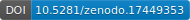

---
# Physician Prompt Engineering

An open-source initiative to improve clinical documentation with practical AI.

**It's time to stop sprinting—come take the subway.**

Visit our website: [Physician Prompt Engineering](https://physicianpromptengineering.com)

---

## What Is This?

Physician Prompt Engineering provides production-ready AI prompts that transform raw conversation transcripts into perfectly formatted clinical notes in seconds.

Combine:
- ✓ **AI Scribes** (listen to your patient conversation)
- ✓ **AI Editor Prompts** (format exactly to your preferences)
- = **Fully automated, personalized clinical notes**

---

## The Three Big Insights

1. **Few-shot examples are critical** - Show, don't tell
2. **Brevity improves quality** - Shorter = faster approval
3. **Separate prompts for separate functions** - Each does one thing well

---

## Get Started

---

## Contributing

We welcome contributions! This is an open-source community resource.

### How to Contribute

Alternate: Use google form on physicianpromptengineering.com

1. **Test a prompt** in your practice
2. **Create a new version** or improvement
3. **Submit a Pull Request** with:
   - Your Specialty: (e.g., Pediatrics, Internal Medicine, Surgery)
   - Prompt Title: A clear, short name for your prompt.
   - Use Cases: What problem does this prompt solve? (e.g., “Formats hospital discharge summaries,” “Generates patient education handouts”)
   - How You’ve Tested It: A brief note on how you’ve used this in your workflow.
   - The Prompt Itself: The full, copy-and-paste-ready text of your prompt.
4. **Community reviews** and provides feedback
5. **Merged and published** on the site

---

## Important Disclaimers
- **Only use within HIPAA-compliant EMR environments**
- **DO NOT use public AI tools** (ChatGPT, Claude, Gemini) with patient data
- Use your EMR's integrated LLM or approved tools only
- All prompts assume human in the loop taking responsbility for final accuracy and output.

## Disclaimer and Terms of Use
### 1. No Medical or Legal Advice
The content on the Peds Coffee website, including all AI prompts, examples, and discussions, is provided for educational and informational purposes only. It is not intended as a substitute for professional medical, billing, or legal advice.

### 2. Clinical Responsibility and Verification
All prompts assume human in the loop taking responsbility for final accuracy and output.  The prompts are tools for documentation efficency, not substitutes for clinical judgment. As the practicing clinician, you retain full and final responsibility for the accuracy and completeness of anything related to using these prompts if you decide to use them. Anything here is provided AS IS without any guarantee or promise of any functionality or usefulness. The goal is to give a starting place for you to learn and create from on your own.  Always read and verify the AI-generated output before finalizing anything. Follow terms of service for any AI scribe tools used.  These tools cannot account for every nuance of a patient encounter; you must ensure the final text accurately reflects your judgement.

### 3. HIPAA and Data Security
These prompts are designed to be used within a secure, HIPAA-compliant environment (e.g., your EMR’s built-in AI tool).  Do not share protected health information (PHI) from your EMR (Epic, Cerner, or others) with public or commercial large language models (LLMs) (e.g., ChatGPT, Gemini, etc.) for use with these prompts.  You must adhere to your organization’s policies regarding the use of AI tools in clinical care.  Ensure IT approval of any AI scribe, large language model, or any other piece of software prior to use.

## License
This project is open source under the [MIT License](LICENSE).

⭐ **If this project helps your workflow, consider giving it a star on GitHub and sharing with others!**