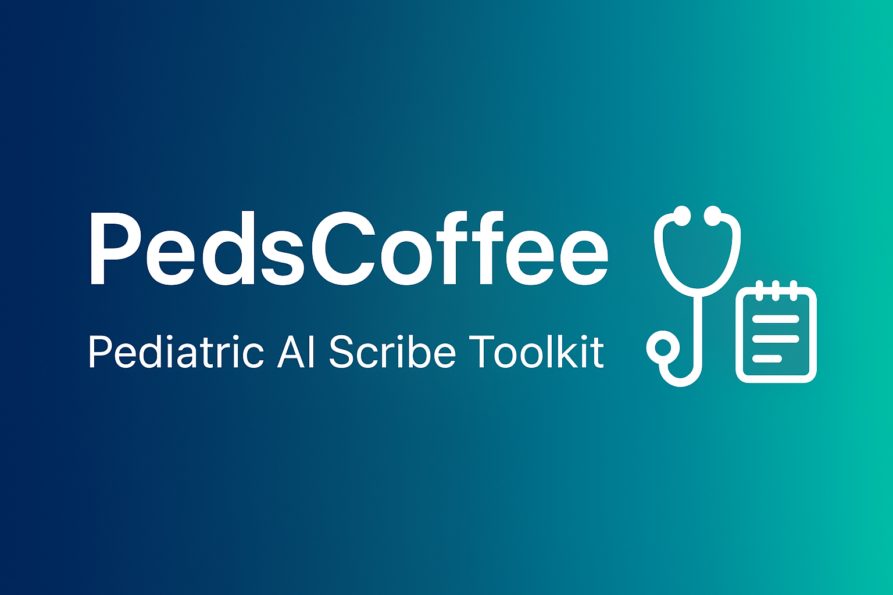

# 🩺 PedsCoffee — Pediatric AI Scribe Toolkit

---

**PedsCoffee** is an educational project demonstrating optimized prompt engineering for pediatric AI scribing workflows.  
It now includes a **fourth prompt** for generating personalized family sign-offs and to-do lists.

_Last updated: October 2025_

---

## 🧱 Contents
| Folder/File | Description |
|--------------|-------------|
| `index.html` | Static GitHub Pages homepage |
| `prompts/` | A/P, Billing, and AVS prompt library |
| `docs/` | Project overview and design context |
| `favicon.png` | Browser tab icon |
| `banner.png` | README banner image |

---

## 🌐 GitHub Pages Site

🔗 **Visit:**  
[`https://pedscoffee.github.io/pedscoffee/`](https://pedscoffee.github.io/pedscoffee/)

---

## 🧠 Core Features
- **A/P Prompt** — converts AI scribe text into concise, problem-oriented notes  
- **Billing Prompt** — determines CPT E/M level with audit-ready reasoning  
- **AVS Prompt** — generates warm, personalized sign-offs and concise family to-do lists  
- **Context File** — explains the project design and EMR workflow goals  

---

## 🌈 Vision
> The PedsCoffee project explores practical, ethical, and efficient prompt design for pediatric EMR workflows.  
> The goal is to share repeatable frameworks that improve documentation clarity, coding reliability, and family communication.

---

## 📄 License
This repository is licensed under the [MIT License](LICENSE).

⭐ **If this project helps your workflow, consider giving it a star on GitHub!**
