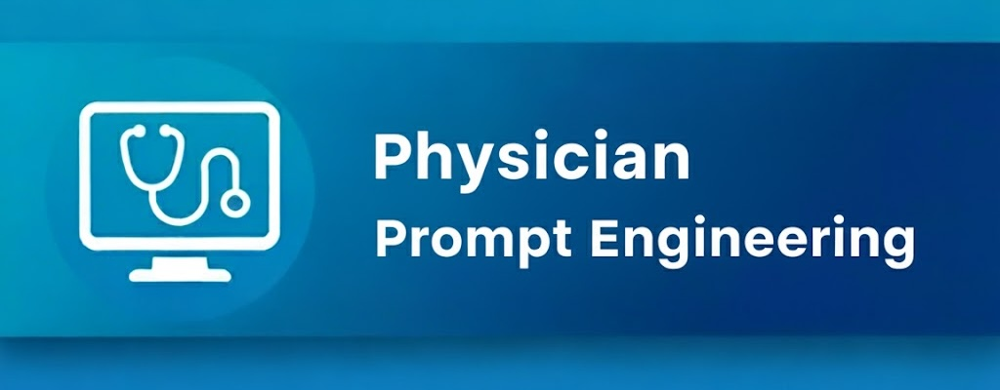
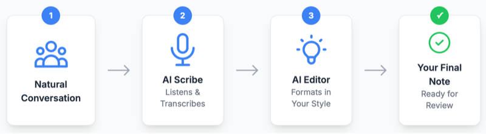

# Transform Your Clinical Documentation in Minutes

**Save 2-5 minutes per patient encounter** by using physician-tested AI prompts that convert AI scribe output into your exact documentation style—no manual editing required.

## The Problem We Solve

AI scribes capture conversations but produce generic, verbose notes that require extensive editing. Our solution: **precision-engineered prompts** that transform raw AI output into concise, personalized documentation matching your exact preferences.

  <iframe 
    width="560" 
    height="315" 
    src="https://www.youtube-nocookie.com/embed/-2ivdNTM7SY?si=ci0EitG8wKOxEp3e" 
    title="Clinical AI Documentation Workflow" 
    frameborder="0" 
    allow="accelerometer; autoplay; clipboard-write; encrypted-media; gyroscope; picture-in-picture; web-share" 
    allowfullscreen>
  </iframe>

## How It Works

{: style="max-width: 80%; height: auto; display: block; margin: 0 auto;" }

Use your EMR's built-in AI features (like Epic's "Generate Text with AI") with our specialized prompts to achieve fully automated, preference-matched documentation.

## Three Essential Clinical Prompts

### 1. Assessment & Plan Formatting
Converts verbose paragraphs into concise, problem-oriented documentation

### 2. Medical Decision Making & Billing
Analyzes complexity and suggests appropriate CPT codes with supporting documentation

### 3. After-Visit Summaries
Generates patient-friendly instructions and follow-up plans

[Access the Prompt Library →]({{ site.baseurl }}/prompt-library)

---

## Core Documentation Principles

### 1. Examples Drive Quality
Providing 3-5 examples of your preferred output format produces superior results compared to lengthy instructions.

### 2. Conciseness Improves Efficiency  
Brief, scannable notes reduce review time and minimize editing requirements.

### 3. Modular Design Ensures Reliability
Dedicated prompts for specific tasks outperform multi-purpose solutions.

[Learn the Complete Methodology →]({{ site.baseurl }}/best-practices)

---

## Getting Started

### Requirements
- EMR with integrated AI text generation (Epic, Cerner, or equivalent)
- Institutional approval for AI documentation tools
- HIPAA-compliant AI scribe service (optional but recommended)

### Implementation Steps
1. Copy relevant prompts from our library
2. Customize examples to match your specialty
3. Test with routine encounters first
4. Scale to complex cases as confidence builds

Ready to contribute? [Share your specialty-specific prompts]({{ site.baseurl }}/contributions)

---

<iframe src="https://pedscoffee.substack.com/embed" width="480" height="320" style="border:1px solid #EEE; background:white;" frameborder="0" scrolling="no"></iframe>

---
 
## Frequently Asked Questions

**What EMR systems are compatible?**
These prompts work with any EMR featuring AI text generation capabilities. Confirmed compatible systems include Epic's "Generate Text with AI," Cerner, and similar platforms with LLM integration.

**How much time can I realistically save?**
Physicians report saving 2-5 minutes per routine encounter and up to 15 minutes on complex visits. Results vary by specialty and documentation requirements.

**Do I need programming experience?**
No technical expertise required. If you can copy and paste text, you can implement these prompts immediately.

**Are these prompts specialty-specific?**
The core framework applies to all specialties. The library includes templates you can customize with specialty-specific examples for optimal results.

**How do I ensure compliance and safety?**
Always use prompts within your institution's approved AI tools. Review all AI-generated content before signing. These prompts enhance efficiency while maintaining your clinical responsibility for accuracy.

## Clinical Responsibility Notice

These prompts are tools for documentation efficiency, not substitutes for clinical judgment. Healthcare providers retain full responsibility for reviewing and approving all AI-generated content before finalizing patient records. Always verify accuracy, completeness, and compliance with institutional policies.

## Open Source License
This project is available under the [MIT License](LICENSE). Free to use, modify, and share.

**Support clinical innovation:** [Star us on GitHub](https://github.com/pedscoffee/PhysicianPromptEngineering/)