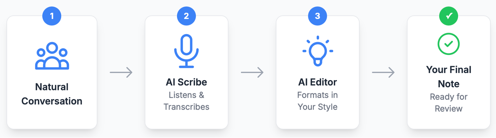

<!-- Hero Section -->
<section class="hero">
  

    <h1 class="hero-title">Transform Your Clinical Documentation in Minutes</h1>
    

      Physician-tested AI prompts that convert AI scribe output into your exact documentation style—no manual editing required. <strong>Save 2-5 minutes per patient encounter.</strong>
    

    

      <a href="{{ '/prompt-library' | relative_url }}" class="btn btn-primary btn-lg">
        Access Prompt Library →
      </a>
      <a href="{{ '/best-practices' | relative_url }}" class="btn btn-secondary btn-lg">
        Learn Methodology
      </a>
    

  

</section>

<!-- Problem Statement -->
<section class="section">
  

    

      <h2>The Problem We Solve</h2>
      
AI scribes capture conversations but produce generic, verbose notes that require extensive editing. Our solution: <strong>precision-engineered prompts</strong> that transform raw AI output into concise, personalized documentation matching your exact preferences.

    

    

      <iframe
        width="560"
        height="315"
        src="https://www.youtube-nocookie.com/embed/-2ivdNTM7SY?si=ci0EitG8wKOxEp3e"
        title="Clinical AI Documentation Workflow"
        frameborder="0"
        allow="accelerometer; autoplay; clipboard-write; encrypted-media; gyroscope; picture-in-picture; web-share"
        allowfullscreen
        loading="lazy">
      </iframe>
    

  

</section>

<!-- How It Works -->
<section class="section" style="background: #f9fafb;">
  

    

      <h2>How It Works</h2>
      
Use your EMR's built-in AI features (like Epic's "Generate Text with AI") with our specialized prompts to achieve fully automated, preference-matched documentation.

    

    
  

</section>

<!-- Three Essential Prompts -->
<section class="section">
  

    

      <h2>Three Essential Clinical Prompts</h2>
      
Precision-engineered for common clinical workflows

    

    

      

        

          <h3>Assessment & Plan Formatting</h3>
        

        

          
Converts verbose paragraphs into concise, problem-oriented documentation that matches your exact style and formatting preferences.

          <ul class="list-disc" style="text-align: left; margin-top: 1rem;">
            <li>Problem-based structure</li>
            <li>Customizable bullet formats</li>
            <li>Brevity-optimized output</li>
          </ul>
        

        

          <a href="{{ '/prompt-library' | relative_url }}#assessment-plan" class="btn btn-primary">View Prompt →</a>
        

      

      

        

          <h3>Medical Decision Making & Billing</h3>
        

        

          
Analyzes clinical complexity and suggests appropriate CPT codes with supporting documentation for accurate billing.

          <ul class="list-disc" style="text-align: left; margin-top: 1rem;">
            <li>MDM level assessment</li>
            <li>CPT code recommendations</li>
            <li>Compliance-ready documentation</li>
          </ul>
        

        

          <a href="{{ '/prompt-library' | relative_url }}#mdm-billing" class="btn btn-primary">View Prompt →</a>
        

      

      

        

          <h3>After-Visit Summaries</h3>
        

        

          
Generates patient-friendly instructions and follow-up plans in clear, accessible language for better patient understanding.

          <ul class="list-disc" style="text-align: left; margin-top: 1rem;">
            <li>Patient-appropriate language</li>
            <li>Clear action items</li>
            <li>Return precautions included</li>
          </ul>
        

        

          <a href="{{ '/prompt-library' | relative_url }}#avs" class="btn btn-primary">View Prompt →</a>
        

      

    

  

</section>

<!-- Core Principles -->
<section class="section" style="background: #ecfdf5;">
  

    

      <h2>Core Documentation Principles</h2>
      
The methodology behind effective clinical AI prompts

    

    

      

        

          
📝

          <h3 style="color: #047857; margin-bottom: 0.75rem;">Examples Drive Quality</h3>
          
Providing 3-5 examples of your preferred output format produces superior results compared to lengthy instructions. Show the AI what you want, don't just tell it.

        

      

      

        

          
⚡

          <h3 style="color: #047857; margin-bottom: 0.75rem;">Conciseness Improves Efficiency</h3>
          
Brief, scannable notes reduce review time from 2-3 minutes to 30-60 seconds while minimizing editing requirements and cognitive load.

        

      

      

        

          
🔧

          <h3 style="color: #047857; margin-bottom: 0.75rem;">Modular Design Ensures Reliability</h3>
          
Dedicated prompts for specific tasks outperform multi-purpose solutions. Chain specialized prompts together for complex workflows.

        

      

    

    

      <a href="{{ '/best-practices' | relative_url }}" class="btn btn-primary btn-lg">Learn the Complete Methodology →</a>
    

  

</section>

<!-- Getting Started -->
<section class="section">
  

    

      <h2>Getting Started</h2>
      
Four simple steps to transform your documentation workflow

    

    

      

        

          <h3>1. Requirements</h3>
        

        

          <ul class="list-disc">
            <li>EMR with integrated AI text generation (Epic, Cerner, or equivalent)</li>
            <li>Institutional approval for AI documentation tools</li>
            <li>HIPAA-compliant AI scribe service (optional but recommended)</li>
          </ul>
        

      

      

        

          <h3>2. Copy Prompts</h3>
        

        

          <ul class="list-disc">
            <li>Browse our <a href="{{ '/prompt-library' | relative_url }}">Prompt Library</a></li>
            <li>Select prompts matching your workflow</li>
            <li>Copy directly into your EMR AI tool</li>
          </ul>
        

      

      

        

          <h3>3. Customize & Test</h3>
        

        

          <ul class="list-disc">
            <li>Add 3-5 examples from your actual notes</li>
            <li>Adjust formatting to match your style</li>
            <li>Test with routine encounters first</li>
          </ul>
        

      

      

        

          <h3>4. Scale & Refine</h3>
        

        

          <ul class="list-disc">
            <li>Expand to complex cases as confidence builds</li>
            <li>Iterate based on output quality</li>
            <li>Share successful prompts with colleagues</li>
          </ul>
        

      

    

  

</section>

<!-- Contribution Callout -->

  

    <h3>Share Your Prompt</h3>
    
Refined a prompt that consistently delivers quality output? Consider sharing it on the <a href="{{ '/contributions' | relative_url }}">contributions page</a>. Your tested solution could save colleagues hours of iteration and help build a stronger resource for the entire clinical community.

  

<!-- Newsletter -->
<section class="section" style="background: #f9fafb;">
  

    

      <h2>Stay Updated</h2>
      
Get the latest prompts, tips, and clinical AI insights delivered to your inbox

    

    

      <iframe src="https://pedscoffee.substack.com/embed" width="480" height="320" style="border:1px solid #EEE; background:white;" frameborder="0" scrolling="no"></iframe>
    

  

</section>

<!-- FAQ -->
<section class="section">
  

    

      <h2>Frequently Asked Questions</h2>
    

    

      

        

          <strong>What EMR systems are compatible?</strong>
          ▼
        

        

          

            
These prompts work with any EMR featuring AI text generation capabilities. Confirmed compatible systems include Epic's "Generate Text with AI," Cerner, and similar platforms with LLM integration. The prompts are platform-agnostic and designed to work with any LLM-powered documentation tool.

          

        

      

      

        

          <strong>How much time can I realistically save?</strong>
          ▼
        

        

          

            
Physicians report saving 2-5 minutes per routine encounter and up to 15 minutes on complex visits. Results vary by specialty and documentation requirements. The time savings compound across your entire clinic day, potentially reclaiming 30-60 minutes daily.

          

        

      

      

        

          <strong>Do I need programming experience?</strong>
          ▼
        

        

          

            
No technical expertise required. If you can copy and paste text, you can implement these prompts immediately. All prompts are provided in plain text format, ready to use in your EMR's AI documentation tool.

          

        

      

      

        

          <strong>Are these prompts specialty-specific?</strong>
          ▼
        

        

          

            
The core framework applies to all specialties. The library includes general templates you can customize with specialty-specific examples for optimal results. Many physicians contribute specialty-adapted versions that you can use as starting points.

          

        

      

      

        

          <strong>How do I ensure compliance and safety?</strong>
          ▼
        

        

          

            
Always use prompts within your institution's approved AI tools. Review all AI-generated content before signing. These prompts enhance efficiency while maintaining your clinical responsibility for accuracy. The prompts are designed to facilitate review, not replace it.

          

        

      

    

  

</section>

<!-- Clinical Responsibility & License -->
<section class="section" style="background: #f9fafb;">
  

    

      <h3 style="margin-top: 0;">⚕️ Clinical Responsibility Notice</h3>
      
These prompts are tools for documentation efficiency, not substitutes for clinical judgment. Healthcare providers retain full responsibility for reviewing and approving all AI-generated content before finalizing patient records. Always verify accuracy, completeness, and compliance with institutional policies.

    

    

      <h3 style="margin-top: 0;">📜 Open Source License</h3>
      
This project is available under the <a href="https://github.com/pedscoffee/PhysicianPromptEngineering/blob/main/LICENSE" target="_blank" rel="noopener noreferrer" style="font-weight: 600;">MIT License</a>. Free to use, modify, and share.

      

        <a href="https://github.com/pedscoffee/PhysicianPromptEngineering/" target="_blank" rel="noopener noreferrer" class="btn btn-primary">
          <svg width="16" height="16" fill="currentColor" viewBox="0 0 16 16" style="margin-right: 4px;">
            <path d="M8 0C3.58 0 0 3.58 0 8c0 3.54 2.29 6.53 5.47 7.59.4.07.55-.17.55-.38 0-.19-.01-.82-.01-1.49-2.01.37-2.53-.49-2.69-.94-.09-.23-.48-.94-.82-1.13-.28-.15-.68-.52-.01-.53.63-.01 1.08.58 1.23.82.72 1.21 1.87.87 2.33.66.07-.52.28-.87.51-1.07-1.78-.2-3.64-.89-3.64-3.95 0-.87.31-1.59.82-2.15-.08-.2-.36-1.02.08-2.12 0 0 .67-.21 2.2.82.64-.18 1.32-.27 2-.27.68 0 1.36.09 2 .27 1.53-1.04 2.2-.82 2.2-.82.44 1.1.16 1.92.08 2.12.51.56.82 1.27.82 2.15 0 3.07-1.87 3.75-3.65 3.95.29.25.54.73.54 1.48 0 1.07-.01 1.93-.01 2.2 0 .21.15.46.55.38A8.012 8.012 0 0 0 16 8c0-4.42-3.58-8-8-8z"/>
          </svg>
          Star us on GitHub
        </a>
      

    

  

</section>

